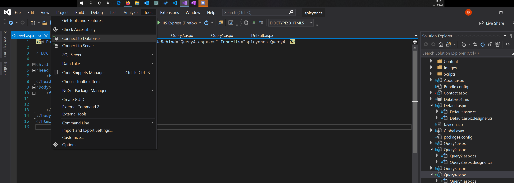
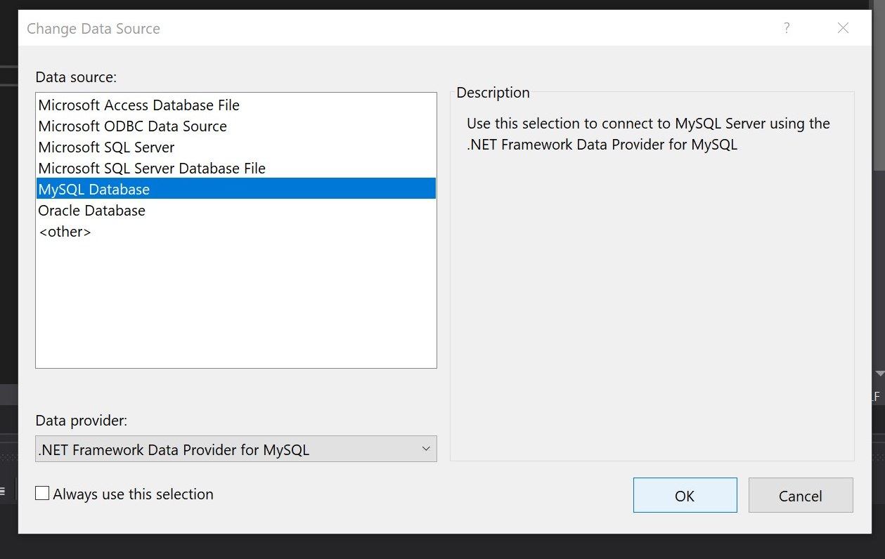
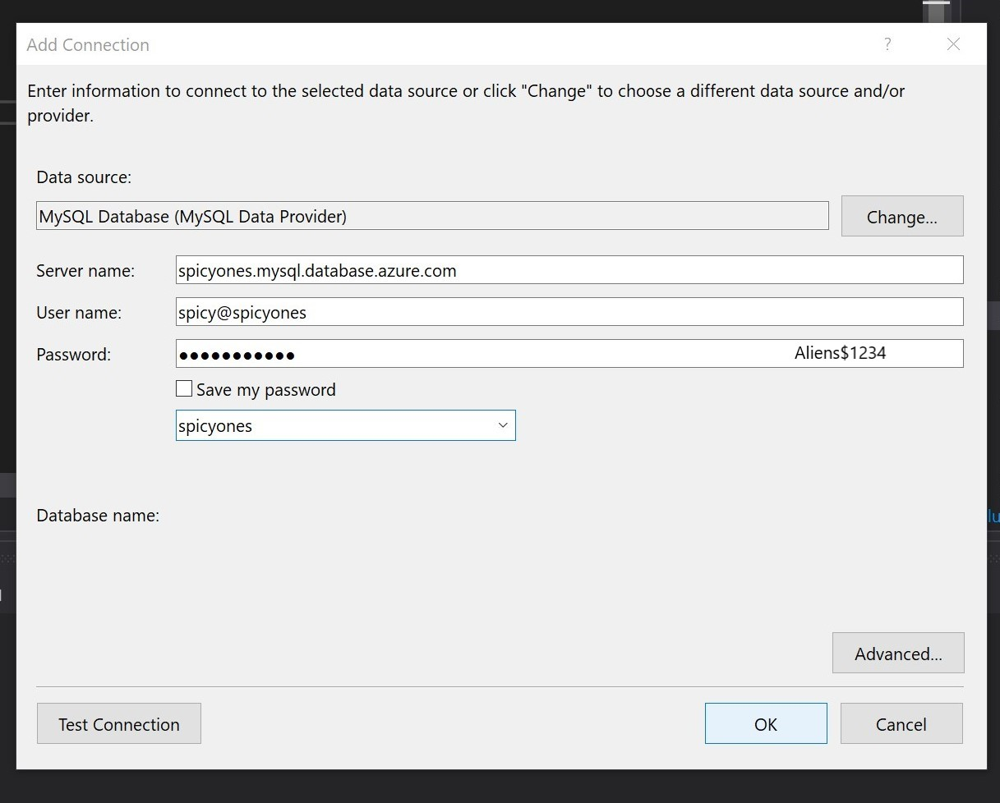

# Spicy Ones

Based on the YouTube series "Hot Ones", [Spicy Ones](http://www.spicyones.com/) is a database and website that displays the hot sauces and celebrities featured on the YouTube show. Our corresponding website allows fans to interact with our database via seeing the results of interesting queries and seeing information about hot sauces that they search for. 

Visit us at http://www.spicyones.com/! 

## Contents
  - [Getting Started](#getting-started)
    - [Quirks and Notes](#quirks-and-notes)
    - [Prerequisites](#prerequisites)
    - [Running Queries](#running-queries)
  - [Built With](#built-with)
  - [Authors and Contributors](#authors-and-contributors)

## Getting Started

These instructions will get you a copy of the project up and running on your local machine for testing purposes. 

### Quirks and Notes 
* Full functionality of the project *cannot* be achieved on school computers

### Prerequisites

* [MySQL workbench](https://dev.mysql.com/downloads/workbench/)
* [Connector/NET](https://dev.mysql.com/downloads/connector/net/)
* [MySQL.Data for VS](https://www.nuget.org/packages/MySql.Data/)
  * This needs to be downloaded as a package within Visual Studio 2019 (under Nuget packages)
* [MySQL Connector for VS](https://www.nuget.org/packages/MySqlConnector/)
  * This needs to be downloaded as a package within Visual Studio 2019 (under Nuget packages)
* A Windows operating system
* A cloned version of the [Spicy Ones repo](https://github.com/ibokov/SpicyOnes)

Brief explanations of some of these resources are featured [here](#built-with).

### Running Queries 

1. Install all of the [prerequisite](#prerequisites) materials. 
2. Open Visual Studio and then click Tools > Connect to Database

3. Select "MySQL Database" with the .NET Framework data provider, as shown below 

4. Enter the following, as shown in the image below: 
* Server name: `spicyones.mysql.database.azure.com` 
* User name: `spicy@spicyones`
* Password: `Aliens$1234`
 
5. Now, you can run the queries via MySQL workbench or Visual Studio! 

## Built With

* [MySQL 5.7](https://dev.mysql.com/downloads/mysql/5.7.html) - DBMS
* [ASP.NET 4.7.2](https://dotnet.microsoft.com/download/dotnet-framework/net472) - Framework
* [Visual Studio 2019](https://visualstudio.microsoft.com/) - Integrated Development Environment
* [Microsoft Azure](https://azure.microsoft.com/en-us/) - Cloud service 

## Authors

* [Ilya Bokov](https://github.com/ibokov)
* [Mariko Briggs](https://github.com/marikobriggs) 
* [Mercedes Chea](https://github.com/mercedeschea)
* [Korey Pecha](https://github.com/brutalmelon)

